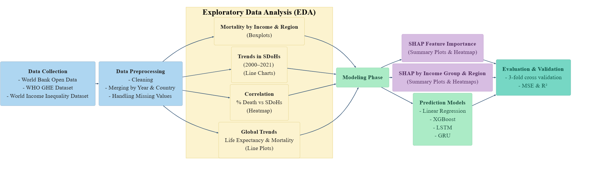

# 🧠 Deep Learning Insights into Social Determinants of Chronic Disease and Longevity

**STEM Fellowship 2025 – National Inter-University Health Data and AI Inquiry Program**
---
## 📄 Description

This project investigates the complex interplay between social determinants of health (SDoH) and chronic disease-related mortality using deep learning and interpretable AI. We utilized a globally representative dataset (2000–2021) combining World Bank indicators, WHO Global Health Estimates, and income inequality data. By applying models such as XGBoost, LSTM, GRU, and Linear Regression, alongside SHAP analysis, we provide both accurate predictions and explainable insights across diseases like diabetes, Alzheimer’s, cardiovascular disease, asthma, and kidney disorders. Our findings advocate for tailored health policy interventions based on income and regional contexts.

---
## 🔄 Data Pipeline (ETL Process)

This project follows an end-to-end **ETL (Extract–Transform–Load) pipeline**:

**Extract**
- Retrieved macro-level health, socioeconomic, and inequality indicators from:
  - World Bank Open Data
  - WHO Global Health Estimates
  - World Income Inequality Database

**Transform**
- Cleaned and standardized country and year identifiers
- Handled missing values and temporal gaps
- Merged datasets at the **country–year level (2000–2021)**
- Engineered SDoH features for modeling and interpretability
- Performed aggregation and normalization for cross-country comparison
---
**Load**
- Loaded the integrated analytical dataset into machine learning and deep learning pipelines
- Used the transformed data for EDA, predictive modeling, and SHAP-based explainability

## 👥 Team

**Team Name:** Chronicare AI  
**Team Members:**  
- Ishrat Jaben Bushra  
- Kin Kwan Liu  
- Muhammad Zaka Shaheryar  
- Sazia Afreen  

---
## 📊 Dataset Description

1. **World Bank Open Data**  
   - Indicators: Life expectancy, education, GDP, healthcare spending  
   - Period: 2000–2021  
   - [Link](https://data.worldbank.org/)

2. **WHO Global Health Estimates**  
   - Leading causes of death: Cardiovascular, Alzheimer’s, Asthma, Kidney diseases, etc.  
   - Years: 2000, 2010, 2015, 2019, 2020, 2021  
   - [Link](https://www.who.int/data/gho/data/themes/mortality-and-global-health-estimates/ghe-leading-causes-of-death)

3. **World Income Inequality Database**  
   - Income shares (top 10%, bottom 40%) by country  
   - Years: 1950–2022  
   - [Link](https://www.wider.unu.edu/project/world-income-inequality-database)
---

## ❓ Research Questions

1. Which SDoH most significantly influence chronic disease mortality in aging populations?
2. How do these influences differ across income groups and geographic regions?
3. Can deep learning models predict chronic disease outcomes from macroscale indicators, and how do SHAP explanations improve interpretability?

---
## 🔄 Workflow

---
## 🧰 Tools & Technologies

- Python (Pandas, NumPy, Matplotlib, Seaborn)
- Scikit-learn  
- XGBoost  
- TensorFlow / Keras (LSTM, GRU)  
- SHAP (SHapley Additive Explanations)  
- Jupyter Notebooks  
- Git & GitHub  

---

## 📦 Deliverables

- Cleaned and preprocessed dataset  
- Exploratory Data Analysis (EDA) visualizations  
- Trained models (XGBoost, LSTM, GRU, Linear Regression)  
- SHAP-based interpretation plots  
- Evaluation reports (R², MSE)  
- Final Report and Poster Presentation  
- GitHub Repository  

---

## 💡 Key Findings

- **XGBoost** consistently achieved highest accuracy (e.g., R² > 0.91), outperforming deep learning models on tabular data.  
- **Top Predictors:** Life expectancy, diabetes prevalence, underemployment, and income inequality.  
- **Income-Based Insights:**  
   - Low-income: Communicable disease burden, unemployment, undernourishment  
   - Middle-income: Inequality, chronic disease transition  
   - High-income: Metabolic risk factors, aging  
- **Regional Patterns:**  
   - South Asia: Undernutrition & diabetes  
   - East Asia: Diabetes-driven mortality  
   - Europe: Aging-linked cardiovascular mortality  
   - Sub-Saharan Africa: Structural vulnerabilities
---
## ⚠️ Limitations

- Sparse data for certain years/countries  
- Lack of individual-level and longitudinal data  
- Limited temporal granularity  
- Potential unobserved confounders (e.g., healthcare quality, genetics)

---
## 🚀 Future Work

- Incorporate **time-aware** models (e.g., temporal transformers)  
- Integrate **individual-level and geospatial data**  
- Apply **multi-step forecasting** with external features (e.g., weather, economic shifts)  
- Enhance explainability with **attention-based neural networks**  

---
## 📚 Publication

This work will be published under the peer-reviewed STEM Fellowship Journal, published by Canadian Science Publishing, with video and full manuscripts in Underline.

👉 **[Link to publication (Coming Soon)](https:)** 
---
## 📜 Acknowledgments
We gratefully acknowledge:

📍 STEM FELLOWSHIP

📍 OverLeaf

📍 RESEARCH CANADA

📍 Canadian Science Publishing

📍 ROCHE

📍 Underline

📍 Microsoft

📍 Canadian Personalized Healthcare Innovation Network (CPHIN)

👤 STEM Fellowship organizers and mentors.

## 📜 License
GNU General Public License v3.0

